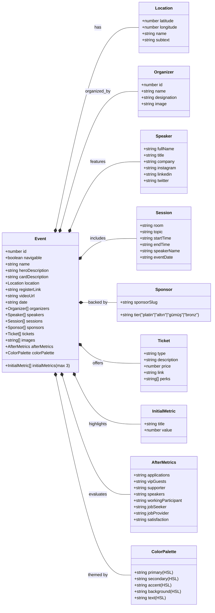

<h1 align="center">Developer MultiGroup Events Platform</h1>

<div align="center">

[](https://github.com/chetanraj/awesome-github-badges)
[](https://kommunity.com/devmultigroup)
[](code_of_conduct.md)
[](https://opensource.org/license/gpl-3-0)
[](https://GitHub.com/Developer-MultiGroup/multigroup-event-page/pulls/)
[](https://GitHub.com/Developer-MultiGroup/multigroup-event-page/issues/)

</div>

## Overview

The event management and showcase platform for Developer MultiGroup. Browse upcoming and past events, register for sessions, and explore speakers — all powered by a built-in admin panel for content management.

## Tech Stack

| Layer         | Technology                                  |
| ------------- | ------------------------------------------- |
| Framework     | Next.js 15 (App Router, React 19)           |
| Language      | TypeScript                                  |
| Styling       | Tailwind CSS + Shadcn/ui (Radix primitives) |
| Database      | Cloudflare D1 (SQLite) via Drizzle ORM      |
| Asset Storage | Cloudflare R2                               |
| Deployment    | Cloudflare Workers (via OpenNextJS)         |
| Forms         | React Hook Form + Zod validation            |
| Animation     | Framer Motion                               |
| Maps          | React Leaflet / Pigeon Maps                 |

## Project Structure

```
src/
├── app/
│   ├── (pages)/                      # Public site (route group)
│   │   ├── layout.tsx                # Navbar + Footer + EventColorProvider
│   │   ├── page.tsx                  # Homepage (latest event hero)
│   │   └── etkinlikler/              # Events listing & detail pages
│   │       ├── page.tsx
│   │       └── [eventName]/page.tsx
│   │
│   ├── admin/                        # Admin panel (separate layout, no public chrome)
│   │   ├── page.tsx                  # Login page
│   │   └── dashboard/
│   │       ├── page.tsx              # Event list
│   │       ├── announcement/         # Announcement management
│   │       └── events/
│   │           ├── new/              # Create event
│   │           └── [id]/             # Edit event (section-based)
│   │               ├── page.tsx      # Basic info + location + colors
│   │               ├── speakers/     # Speakers & organizers
│   │               ├── sessions/     # Sessions
│   │               ├── sponsors/     # Sponsors
│   │               ├── tickets/      # Tickets
│   │               ├── metrics/      # Initial & after metrics
│   │               ├── colors/       # Color palette
│   │               └── images/       # Event gallery
│   │
│   └── api/
│       ├── events/                   # Public: GET all events, GET by slug
│       ├── announcement/             # Public: GET active announcement
│       ├── og/                       # Open Graph image generation
│       └── admin/                    # Protected admin API
│           ├── auth/                 # POST login, GET check, DELETE logout
│           ├── events/               # GET list, POST create
│           ├── events/[id]/          # GET, DELETE + per-section PUT endpoints
│           ├── upload/               # POST image to R2
│           └── announcement/         # PUT announcement
│
├── components/
│   ├── admin/                        # Admin panel components
│   │   ├── admin-header.tsx          # Header with logo + navigation
│   │   ├── auth-guard.tsx            # Client-side auth wrapper
│   │   ├── event-section-nav.tsx     # Tab navigation for event sections
│   │   ├── image-crop-dialog.tsx     # Image upload + crop dialog
│   │   ├── unsaved-changes-dialog.tsx
│   │   └── form-sections/            # Per-section form components
│   ├── common/                       # Shared components
│   ├── event-components/             # Event page components
│   ├── speaker-components/           # Speaker cards, tooltips
│   ├── navigation-components/        # Navbar, footer
│   └── ui/                           # Shadcn/ui primitives
│
├── db/
│   ├── schema.ts                     # Drizzle table definitions
│   ├── queries.ts                    # Query helpers (getAllEvents, etc.)
│   └── index.ts                      # D1 connection via Cloudflare bindings
│
├── lib/
│   ├── admin-auth.ts                 # HMAC-SHA256 session creation & validation
│   ├── slugify.ts                    # URL-safe slug generation
│   ├── event-utils.ts                # Date/event helper functions
│   ├── utils.ts                      # cn() and general utilities
│   └── validations/                  # Zod schemas for all forms
│
├── types/index.ts                    # Event, Speaker, Session, etc.
├── context/EventColorContext.tsx      # Dynamic per-event color theming
└── middleware.ts                      # Server-side auth redirect for /admin/dashboard
```

## Database Schema

SQLite via Drizzle ORM. All child tables cascade-delete when the parent event is removed.

```
events ─────────┬── speakers (fullName, title, company, socials)
                ├── organizers (name, designation, image)
                ├── sessions (room, topic, startTime, endTime, speakerName)
                ├── sponsors (tier, sponsorSlug)
                ├── tickets (type, description, price, link, perks[])
                ├── event_images (url)
                ├── initial_metrics (title, value) — max 3
                └── after_metrics (8 text fields) — optional, 1:1

announcements (standalone) — site-wide banner with toggle
```

Color palette and location are embedded directly in the `events` table as flat columns (HSL strings and lat/lon).

## Authentication

The admin panel uses a shared secret key — no user accounts.

1. Admin enters the secret key at `/admin`
2. Server validates against `ADMIN_SECRET_KEY` env var
3. On success, creates an HMAC-SHA256 signed cookie (`admin_session`) valid for 24 hours
4. **Server-side middleware** (`src/middleware.ts`) intercepts all `/admin/dashboard/*` requests and redirects to `/admin` if the session is invalid or missing
5. A client-side `AuthGuard` component provides a secondary check

Uses `crypto.subtle` (Web Crypto API) — compatible with Cloudflare Workers runtime.

## Getting Started

### Prerequisites

- Node.js 18+
- npm
- [Wrangler CLI](https://developers.cloudflare.com/workers/wrangler/) (`npm i -g wrangler`)

### Setup

```bash
# Clone the repo
git clone https://github.com/Developer-MultiGroup/multigroup-event-page.git
cd multigroup-event-page

# Install dependencies
npm install --legacy-peer-deps

# Copy environment variables
cp .env.local.example .env.local
# Edit .env.local with your values (see Environment Variables below)

# Set up local D1 database
npm run db:migrate:local

# (Optional) Seed with sample data
npm run db:seed

# Start development server
npm run dev
```

The dev server runs via Wrangler, simulating the Cloudflare Workers environment locally. For a faster iteration loop on UI-only changes, use `npm run dev:next` (standard Next.js dev server — won't have D1/R2 bindings).

### Environment Variables

| Variable                | Description                                                 |
| ----------------------- | ----------------------------------------------------------- |
| `CLOUDFLARE_API_TOKEN`  | Wrangler CLI auth token (Workers, D1, R2 permissions)       |
| `CLOUDFLARE_ACCOUNT_ID` | Your Cloudflare account ID                                  |
| `NEXT_PUBLIC_R2_URL`    | Public URL for the R2 asset bucket                          |
| `ADMIN_SECRET_KEY`      | Secret key for admin authentication (32+ chars recommended) |

For production, `ADMIN_SECRET_KEY` must also be set as a Cloudflare Workers secret:

```bash
wrangler secret put ADMIN_SECRET_KEY
```

## Available Scripts

| Script                      | Description                                          |
| --------------------------- | ---------------------------------------------------- |
| `npm run dev`               | Build with OpenNextJS + start Wrangler dev server    |
| `npm run dev:next`          | Standard Next.js dev server (no Cloudflare bindings) |
| `npm run build`             | Next.js production build                             |
| `npm run deploy`            | Build and deploy to Cloudflare Workers               |
| `npm run db:generate`       | Generate Drizzle migration files                     |
| `npm run db:migrate:local`  | Apply migrations to local D1                         |
| `npm run db:migrate:remote` | Apply migrations to production D1                    |
| `npm run db:seed`           | Seed database from scripts                           |
| `npm run r2:upload`         | Upload assets to R2                                  |
| `npm run format`            | Format code with Prettier                            |
| `npm run lint`              | Run ESLint                                           |

## Admin Panel

The admin panel lives at `/admin` and is never linked from the public site. It provides full CRUD for events and announcement management.

### Event Editing

Events are edited through section-based pages — each section saves independently:

| Section        | What it manages                                                      |
| -------------- | -------------------------------------------------------------------- |
| **Basic Info** | Name, descriptions, date, registration link, location, color palette |
| **Speakers**   | Speaker profiles + organizer list with image upload                  |
| **Sessions**   | Session schedule with room assignment and speaker linking            |
| **Sponsors**   | Sponsor tiers and logos with image crop/upload                       |
| **Tickets**    | Ticket types, pricing, purchase links, and perks                     |
| **Metrics**    | Hero metrics (max 3) and optional post-event statistics              |
| **Colors**     | Per-event HSL color palette with live preview                        |
| **Images**     | Event gallery images with upload and manual URL entry                |

### Creating an Event

1. Click **"+ New Event"** on the dashboard
2. Fill in basic info (name, date, location, colors) — these are the minimum required fields
3. The event is created and you're redirected to the section-based editor
4. Add speakers, sessions, sponsors, etc. through their respective tabs

### Image Assets

Images are stored in Cloudflare R2 under the `academy-assets` bucket. The upload flow includes client-side cropping (speakers: 400x400 square, sponsors: 500x200 rectangle) and WebP conversion before upload.

R2 path convention:

```
{event-slug}/speakers/{slugified-name}.webp
{event-slug}/sponsors/{sponsor-slug}.webp
{event-slug}/gallery/{index}.webp
```

## Data Model



## API Endpoints

### Public

| Method | Path                 | Description                    |
| ------ | -------------------- | ------------------------------ |
| GET    | `/api/events`        | All events with full relations |
| GET    | `/api/events/[slug]` | Single event by slugified name |
| GET    | `/api/announcement`  | Active site-wide announcement  |

### Admin (requires `admin_session` cookie)

| Method | Path                                | Description                           |
| ------ | ----------------------------------- | ------------------------------------- |
| POST   | `/api/admin/auth`                   | Login with secret key                 |
| GET    | `/api/admin/auth`                   | Validate current session              |
| DELETE | `/api/admin/auth`                   | Logout (clear cookie)                 |
| GET    | `/api/admin/events`                 | All events (admin view)               |
| POST   | `/api/admin/events`                 | Create event                          |
| GET    | `/api/admin/events/[id]`            | Get event by ID (raw DB row)          |
| DELETE | `/api/admin/events/[id]`            | Delete event (cascade)                |
| PUT    | `/api/admin/events/[id]/basic-info` | Update basic info + location + colors |
| PUT    | `/api/admin/events/[id]/speakers`   | Update speakers + organizers          |
| PUT    | `/api/admin/events/[id]/sessions`   | Update sessions                       |
| PUT    | `/api/admin/events/[id]/sponsors`   | Update sponsors                       |
| PUT    | `/api/admin/events/[id]/tickets`    | Update tickets                        |
| PUT    | `/api/admin/events/[id]/metrics`    | Update metrics                        |
| PUT    | `/api/admin/events/[id]/colors`     | Update color palette                  |
| PUT    | `/api/admin/events/[id]/images`     | Update event images                   |
| PUT    | `/api/admin/announcement`           | Update announcement                   |
| POST   | `/api/admin/upload`                 | Upload image to R2                    |

## Deployment

```bash
# One-command deploy to Cloudflare Workers
npm run deploy

# Apply database migrations to production
npm run db:migrate:remote

# Set production admin secret
wrangler secret put ADMIN_SECRET_KEY
```

The project uses `wrangler.toml` for Cloudflare configuration including D1 database binding (`DB` -> `academy-db`) and R2 bucket binding (`ASSETS_BUCKET` -> `academy-assets`).

## Contributing

Check the [issues](https://github.com/Developer-MultiGroup/multigroup-event-page/issues) for open tasks. Contributions are welcome.

## License

See [LICENSE](LICENSE) for details.

## Contact

For questions about the project, reach out at `me@furkanunsalan.dev`.
